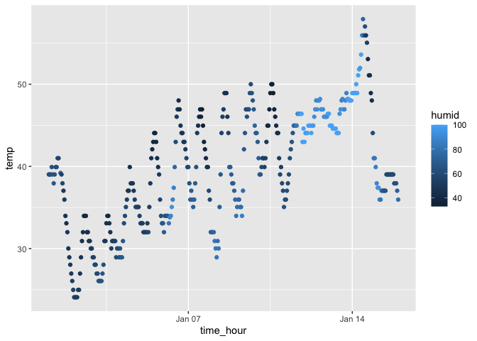

p8105_hw1_md4270
================
Manye Dong
2023-09-14

``` r
library(moderndive)
library(tidyverse)
```

## Problem 1

``` r
data("early_january_weather")
```

``` r
early_january_weather
```

    ## # A tibble: 358 × 15
    ##    origin  year month   day  hour  temp  dewp humid wind_dir wind_speed
    ##    <chr>  <int> <int> <int> <int> <dbl> <dbl> <dbl>    <dbl>      <dbl>
    ##  1 EWR     2013     1     1     1  39.0  26.1  59.4      270      10.4 
    ##  2 EWR     2013     1     1     2  39.0  27.0  61.6      250       8.06
    ##  3 EWR     2013     1     1     3  39.0  28.0  64.4      240      11.5 
    ##  4 EWR     2013     1     1     4  39.9  28.0  62.2      250      12.7 
    ##  5 EWR     2013     1     1     5  39.0  28.0  64.4      260      12.7 
    ##  6 EWR     2013     1     1     6  37.9  28.0  67.2      240      11.5 
    ##  7 EWR     2013     1     1     7  39.0  28.0  64.4      240      15.0 
    ##  8 EWR     2013     1     1     8  39.9  28.0  62.2      250      10.4 
    ##  9 EWR     2013     1     1     9  39.9  28.0  62.2      260      15.0 
    ## 10 EWR     2013     1     1    10  41    28.0  59.6      260      13.8 
    ## # ℹ 348 more rows
    ## # ℹ 5 more variables: wind_gust <dbl>, precip <dbl>, pressure <dbl>,
    ## #   visib <dbl>, time_hour <dttm>

``` r
nrow(early_january_weather)
```

    ## [1] 358

The variables in this dataset include important variables such as year
and month indicating the data is about weather from January 2013. There
are also temp(temperature at the start of each hour), humid(humidity in
percentage), and visib(visibility) and time_hour (the time that the
temperature is recorded).

It has 15 columns and 358 rows. The mean temperature is 39.5821229
degree Fahrenheit.

``` r
ggplot(early_january_weather, aes(x=time_hour, y=temp, color = humid)) + geom_point()
```

<!-- --> The
patterns that are apparent in this plot: Firstly, it seems to be more
humid with higher temperature. Secondly, the humidity increases in
oscillation from the beginning of January to the end (it becomes more
humid as time progresses).

``` r
ggsave("humid_scatter.png")
```

    ## Saving 7 x 5 in image

## Problem 2

``` r
# a random sample of size 10 from a standard Normal distribution
rand_samp = rnorm(10)
```

``` r
# a logical vector indicating whether elements of the sample are greater than 0
logical = rand_samp > 0
```

``` r
# a character vector of length 10
char_vec = vector("character", 10)
```

``` r
# a factor vector of length 10, with 3 different factor “levels”
levels = c("Level1", "Level2", "Level3")
factor_vec = factor(rep(levels, length.out=10))
```

``` r
df = tibble(random_sample = rand_samp, 
            logical_vector = logical,  
            char_vector = char_vec, 
            factor_vector = factor_vec)
df
```

    ## # A tibble: 10 × 4
    ##    random_sample logical_vector char_vector factor_vector
    ##            <dbl> <lgl>          <chr>       <fct>        
    ##  1        0.958  TRUE           ""          Level1       
    ##  2        1.75   TRUE           ""          Level2       
    ##  3        0.513  TRUE           ""          Level3       
    ##  4       -0.197  FALSE          ""          Level1       
    ##  5       -1.16   FALSE          ""          Level2       
    ##  6        0.296  TRUE           ""          Level3       
    ##  7        0.521  TRUE           ""          Level1       
    ##  8       -0.0805 FALSE          ""          Level2       
    ##  9       -0.725  FALSE          ""          Level3       
    ## 10        0.982  TRUE           ""          Level1

Taking the mean of each variable:

``` r
# mean for random numbers vector
random_mean = mean(pull(df, random_sample))
random_mean
```

    ## [1] 0.2851962

``` r
# mean for logical vector
logical_mean = mean(pull(df, logical_vector))
logical_mean
```

    ## [1] 0.6

``` r
# mean for character vector
char_mean = mean(pull(df, char_vector))
```

    ## Warning in mean.default(pull(df, char_vector)): argument is not numeric or
    ## logical: returning NA

``` r
char_mean
```

    ## [1] NA

``` r
# mean for factor vector
factor_mean = mean(pull(df, factor_vector))
```

    ## Warning in mean.default(pull(df, factor_vector)): argument is not numeric or
    ## logical: returning NA

``` r
factor_mean
```

    ## [1] NA

Taking the mean for random sample vector and logical vector worked, but
did not work for character and factor vectors.

Now, we convert the character and factor variable type:

``` r
char_numeric = as.numeric(char_vec)
char_numeric

factor_numeric = as.numeric(factor_vec)
factor_numeric
```

The character vector turns all into “NA” and the factor vector becomes
the level they represent, as in numbers from 1 to 3. The character
vectors is all “NA” because characters/strings cannot be converted to
numbers anyhow. This helps explains why we cannot calculate the mean for
the character vector.

- why does
